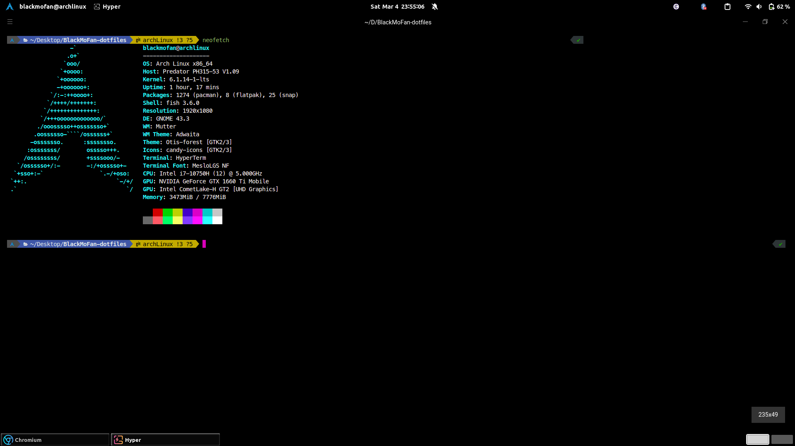

# BlackMoFan's dotfiles

**Warning**: Don’t blindly use my settings unless you know what they mean. Use at your own risk!

## Contents

- vim config
  - Plugins are managed with [vim-Vundle](https://github.com/VundleVim/Vundle.vim)
- tmux config
- bash config
- zsh config

## Vim setup

- [vim-plug](https://github.com/junegunn/vim-plug) - A minimalist Vim plugin manager
- [nvim-lspconfig](https://github.com/neovim/nvim-lspconfig) - A collection of configurations for Neovim's built-in LSP
- [nvim-treesitter](https://github.com/nvim-treesitter/nvim-treesitter) - [Treesitter](https://github.com/tree-sitter/tree-sitter) configurations and abstraction layer for Neovim
- [nvim-cmp](https://github.com/hrsh7th/nvim-cmp) - A completion plugin for neovim coded in Lua
- [lspsaga.nvim](https://github.com/tami5/lspsaga.nvim) - A light-weight LSP plugin based on Neovim built-in LSP with highly a performant UI
- [telescope.nvim](https://github.com/nvim-telescope/telescope.nvim) - A highly extendable fuzzy finder over lists
- [defx.nvim](https://github.com/Shougo/defx.nvim) - A file explorer

## Shell setup

- [Fish shell](https://fishshell.com/)
- [Fisher](https://github.com/jorgebucaran/fisher) - Plugin manager
- [Tide](https://github.com/IlanCosman/tide) - Shell theme. Use version 5: `fisher install ilancosman/tide@v5`
- [Nerd fonts](https://github.com/ryanoasis/nerd-fonts) - Powerline-patched fonts. I use Hack.
- [z for fish](https://github.com/jethrokuan/z) - Directory jumping
- [Exa](https://the.exa.website/) - `ls` replacement
- [ghq](https://github.com/x-motemen/ghq) - Local Git repository organizer
- [peco](https://github.com/peco/peco) - Interactive filtering
